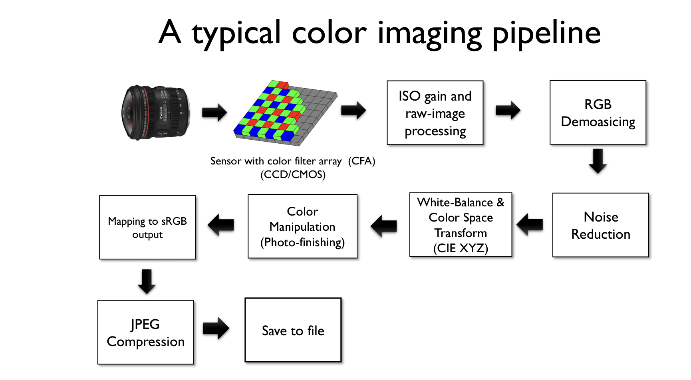

# raw2rgb


An image processing pipeline from RAW image format to RGB color image.

Convert raw image format to RGB png file.

# Overview


Screen shots taken from ICCV 2019: [Camera Processing Pipeline](https://www.eecs.yorku.ca/~mbrown/ICCV2019_Brown.html)

Given a raw `.tiff` image, how do we convert it to a final/pretty .png file with RGB color space.


## Example Usage

Sample raw image (The actual raw .tiff image is located in `data/raw/sample.tiff`, this top image is a screenshot of it mainly for demonstration purpose.)


Result RGB image.

*The sample images are taken from [CSCi 1290](https://cs.brown.edu/courses/csci1290/labs/lab_raw/index.html) at Brown University.*

# Code Example

```python

import raw2rgb
raw_cvtr = raw2rgb.convert.RawConvert()
raw_cvtr.toRGB("data/raw/sample.tiff","data/rgb/sample.png")

```
### You can also run the example code given in `tutorial/example_raw2rgb.py` once the package is installed.


# Getting started

## Install using pip.


To install this package:

```bash
pip install raw2rgb
```

One installed, copy and paste the line below in your favorite shell.

```python
python3 tutorial/example_raw2rgb.py
```

Done!

## Build from source

Clone the repo or download the ZIP file directly.

```bash
git clone https://github.com/vilktor370/raw2rgb.git
```


Create `Virtual Environment`(This step is optional but I founds it very helpful in Python Development.) If you would like to know what `Virtual Environment` is, check out this [link](https://realpython.com/python-virtual-environments-a-primer/#:~:text=One%20of%20your%20projects%20might,use%20a%20Python%20virtual%20environment.)


```python
python -m venv env
```

Activate your Virtual Environment:

```python
source env/bin/activate # Unix (Mac/Linux)

env/Scripts/activate # Windows
```

Install required packages (only one line needs to be excuted).

```python
pip install -r requirements.txt  # normal build

pip install -r requirements_dev.txt # only install this if you would like to run style-checking, tests cases.
```

Run sample code to verify install succeed.

```python
python3 tutorial/example_raw2rgb.py
```

Done!

# Contribute
Any help is welcomed. Spell check on README.md, code suggestions, potential new features. Feel free to submit an issue.
<!-- # Theory
## Normalization

## White balancing

## Debayering/Demoasicing

## Mapping to sRGB

## Color manipulation

## Gamma Correction -->
